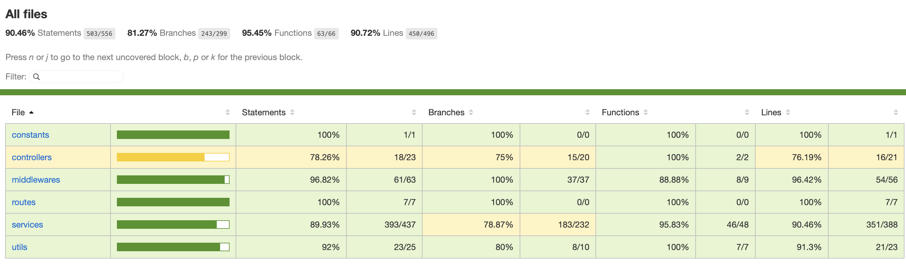

# Rapport de Projet — Groupe GGS 2TL1

---

## 1. Pitch de l'application

> **[GGS]** est une plateforme e-commerce de vente de vetements permettant aux utilisateurs de parcourir un catalogue de produits, de les ajouter à un panier et de passer des commandes en ligne.

L'application propose :
- Un catalogue de produits filtrable par catégorie
- Un système de panier persistant
- Une gestion des commandes
- Un back-office pour l'administration des produits
- Une inscription pour l'utilisateur
- Un login sécurisé
- Un moyen de paiement sécurisé

Stack technique :
- **Frontend** : React + TypeScript (Vite)
- **Backend** : Node.js + Express + TypeScript + Prisma
- **Base de données** : MySQL via Prisma ORM (Supabase)
- **Déploiement** : Docker, Nginx, GitHub Actions

---

## 2. Refactoring initial

### Quel code a été choisi ?

> *Code de base : Projet de Gregory*

Nous avons retenu le code de **Gregory Ly**, car il avait une structure claire, refactorée et avec le moins de code smells.Il y avait une séparation des couches métiers (Controllers/Services/Routes) dés le départ.


### Difficultés d'adaptation des autres membres

> *(À compléter par les deux autres membres)*

**Membre 2 — [Troch Stéfan]** :
- Gregory Travaille sur mac, j'ai donc eu pas mal de soucis avec certaines dépendances spéficiques pour mac.
- L'utilisation de fichier .env a été généralisée dans le projet, mais nous avons parfois eu un manque de communication sur ce qu'elle contenait.

**Membre 3 — [Prénom NOM]** :
- ...

---

## 3. Infrastructure de déploiement

```
┌─────────────────────────────────────────────────────┐
│                    GitHub Repository                │
│                                                     │
│  push / PR  →  GitHub Actions CI/CD Pipeline        │
│                        │                            │
│              ┌─────────▼──────────┐                 │
│              │   Build & Tests    │                 │
│              │  (npm test, lint)  │                 │
│              └─────────┬──────────┘                 │
│                        │ (si succès)                │
│              ┌─────────▼──────────┐                 │
│              │   Docker Build     │                 │
│              │ image client       │                 │
│              │ image server       │                 │
│              └─────────┬──────────┘                 │
└────────────────────────┼────────────────────────────┘
                         │ deploy
                         ▼
┌───────────────────────────────────────────────────────┐
│                    Serveur VPS                        │
│                                                       │
│   ┌─────────────────────────────────────────────────┐ │
│   │              Docker Compose                     │ │
│   │                                                 │ │
│   │  ┌──────────┐   ┌──────────┐   ┌─────────┐      │ │
│   │  │  Nginx   │   │ Client   │   │ Server  │      │ │
│   │  │ :80/:443 │── │ React    │   │ Node.js │      │ │
│   │  │ (reverse │   │ :5173    │   │ :3000   │      │ │
│   │  │  proxy)  │── │          │   │         │      │ │
│   │  └──────────┘   └──────────┘   └────┬────┘      │ │
│   │                                     │           │ │
│   │                          ┌──────────▼─────────┐ │ │
│   │                          │   Redis (cache)    │ │ │
│   │                          │   [optionnel]      │ │ │
│   │                          └──────────┬─────────┘ │ │
│   └─────────────────────────────────────┼───────────┘ │
└─────────────────────────────────────────┼─────────────┘
                                          │ (si cache miss)
                                          ▼
                         ┌─────────────────────────────┐
                         │         Supabase            │
                         │   (PostgreSQL managé +      │
                         │    Auth + Storage)          │
                         │   accessible via Internet   │
                         └─────────────────────────────┘
```
┌─────────────────────────────────────────────────────────────┐
│                      GitHub Actions                         │
│                                                             │
│  push / PR                                                  │
│      │                                                      │
│      ▼                                                      │
│  ┌─────────────────────┐                                    │
│  │      CI - tests     │                                    │
│  │  unit + intégration │                                    │
│  └──────────┬──────────┘                                    │
│             │                                               │
│             ▼                                               │
│  ┌─────────────────────┐                                    │
│  │   Security check    │                                    │
│  │     OWASP ZAP       │                                    │
│  └──────────┬──────────┘                                    │
│             │                                               │
│      ┌──────┴──────┐                                        │
│      │             │                                        │
│      ▼             ▼                                        │
│  ┌──────────┐  ┌──────────┐                                 │
│  │  Build   │  │    CD    │                                 │
│  │  back    │  │ frontend │                                 │
│  │  Docker  │  │   SCP    │                                 │
│  └────┬─────┘  └────┬─────┘                                 │
│       │             │                                       │
│       └──────┬──────┘                                       │
│              │                                              │
│  ┌───────────────────────┐                                  │
│  │  Monitoring           │                                  │
│  │  cron  /30            │                                  │
└──┴───────────────────────┴──────────────────────────────────┘
               │
               ▼
┌─────────────────────────────────────────────────────────────┐
│                          VPS                                │
│                                                             │
│  ┌───────────────────────────────────────────────────────┐  │
│  │                   Docker Compose                      │  │
│  │                                                       │  │
│  │  ┌───────────┐    ┌───────────┐    ┌───────────┐      │  │
│  │  │   Nginx   │    │  React    │    │  Node.js  │      │  │
│  │  │ :80/:443  │    │  :5173    │    │  :3000    │      │  │
│  │  │  reverse  │    │   CLIENT  │    │ Server    │      │  │
│  │  └───────────┘    └───────────┘    └─────┬─────┘      │  │
│  │                                          │            │  │
│  │                                   ┌──────▼──────┐     │  │
│  │                                   │    Redis    │     │  │
│  │                                   │   (cache)   │     │  │
│  │                                   └──────┬──────┘     │  │
│  └──────────────────────────────────────────┼────────────┘  │
└─────────────────────────────────────────────┼───────────────┘
                                              │ cache miss
                                              ▼
                             ┌────────────────────────────┐
                             │          Supabase          │
                             │    PostgreSQL + Auth       │
                             └────────────────────────────┘


**Rôle de chaque composant :**

- **GitHub Actions** : pipeline CI/CD qui lance les tests, build les images Docker et déploie sur le serveur à chaque push sur `main`
- **Docker / Docker Compose** : conteneurisation de chaque service (client, server) pour garantir un environnement reproductible. Il y a une petite gestion de micro service (juste pour le chemin des paiements)
- **Nginx** : reverse proxy qui redirige les requêtes HTTP/HTTPS vers le bon conteneur (frontend ou API) + limit_req qui limite les attaques DDOS + header pour les securités owasp
- **Supabase** : base de données PostgreSQL hébergée externement (hors VPS), remplace le MySQL local. Le serveur Node.js s'y connecte via Prisma avec l'URL de connexion Supabase
- **Redis (optionnel)** : couche de cache en mémoire pour éviter des requêtes répétées vers Supabase. Si une donnée est en cache, le serveur la retourne directement sans interroger la DB

---

## 4. Design Patterns utilisés

### Design Pattern

**Quoi** : `Patron de création`

**Où** : `server/src/config/prisma.ts`

**Pourquoi** : Utilisation d'un singleton pour créer une seule instance du client Prisma, pour la réutiliser dans toute l'application. Cela permet d'éviter plus connexions à la base de données.

**Quoi** : `Patron structurel`

**Où** : `server/src/services/`

**Pourquoi** : Utilisation de patron de création pour que les controllers puissent récupérer des données sans connaître la logique métier. Cema rends le code plus lisible et plus facillement maintenable et testable.

**Quoi** : `Chain of Responsability`

**Où** : `server/src/server.ts`

**Pourquoi** : Chaque middleware a une responsabilité précise. Si une étape échoue, la chaîne s’arrête et une réponse est renvoyée. Sinon, le middleware appelle next() pour passer au suivant. Cela permet de composer facilement les traitements d’une requête.

```
Route → Controller → Service → Prisma (DB)
```

### MVC (Model-View-Controller)

**Où** : structure globale du backend (`routes/`, `controllers/`, `services/`)

**Pourquoi** : organiser le code de façon lisible et maintenable, chaque couche ayant une responsabilité unique.

---

## 5. Couverture de tests (Coverage)



Le rapport de couverture montre une couverture globale satisfaisante côté serveur : **90,47 %** des instructions sont couvertes, **95,45 %** des fonctions sont testées et **81,27 %** des branches conditionnelles sont couvertes.

Les fichiers les mieux couverts sont principalement les middlewares de validation, les routes produits et plusieurs services métier comme `authService.ts`, `catServices.ts`, `prodServices.ts` et `userServices.ts`, qui atteignent **100 %** de couverture. Cela montre que les fonctionnalités principales comme l'authentification, les produits, les catégories et les utilisateurs sont bien testées.

Les fichiers moins bien couverts sont surtout `adminCategoryServices.ts` avec environ **58 %**, `errorHandlers.ts` avec **60 %**, ainsi que certains controllers ou services admin.

